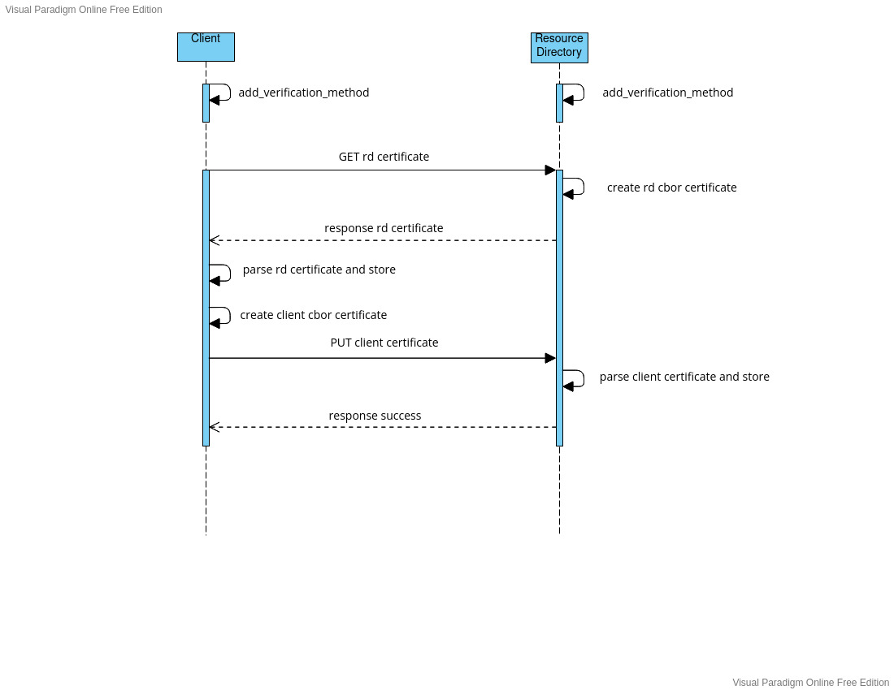

#certificate exchange

##about

This project contains the source code exchanging certificates between a client and a resource directory

doriot_wot contains 2 modules,one for client and one for resource directory(rd)

examples folder contains example application for client and resouce directory

The project is still in its early phase, and several optimizations need to be done. 

the key exchange happens as per the sequence diagram below.

Applications can be tested with two native instances of riot,and communicating via tap interface 

#Usage

- Create two tap interfaces by "./dist/tools/tapsetup/tapsetup --create 2"

- set RIOTBASE properly in makefile and build client and rd applications in examples

- enter "help" to see the availbe commands

- On rd terminal,add psk vertification by "wotrd -v psk"

- note the ip address of rd using "ifconfig" command

- on client terminal,type "wotc -v psk ip_address_of_rd"

- client and resource directory exchnages certificates, and are stored in list.

- To check,If the certficate is stored,type "wotf alice" in rd terminal.(alice is the default name for the client)

#issues

- after exchanging the certificates,"ifconfig" command shows the name of stored in last field,but the implementation of "ifconfig" is not touched in the modules.

- list implentation can be found in wot_list.c and header is in wot_list.h

- when list implemntation is tested seperattely,if does affect the ifconfig command 

#path to wot_list.c

- both client and rd uses list to store peers certificates.

- for eg client PUT its certificate to rd.On the rd side,the flow if as explained below  
   
    wotrd.c -> wot_cbor.c ->wot_list.c
    
    - _cli_cert_handler( ) function wot_rd.c receives the Client certificate(public key and common name)
    
    - wot_parse_cbor_cert() function in wot_cbor.c parces the certificate
    
    - wot_cert_add() function in wot_list.c stores the certificate in list
    
- Similar steps are also performed on the cliend side to store certificates 
	

